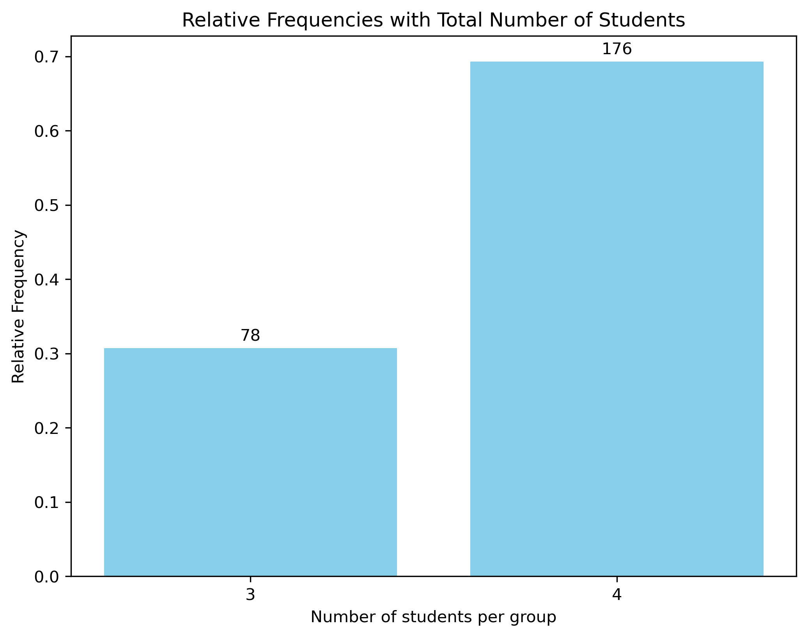
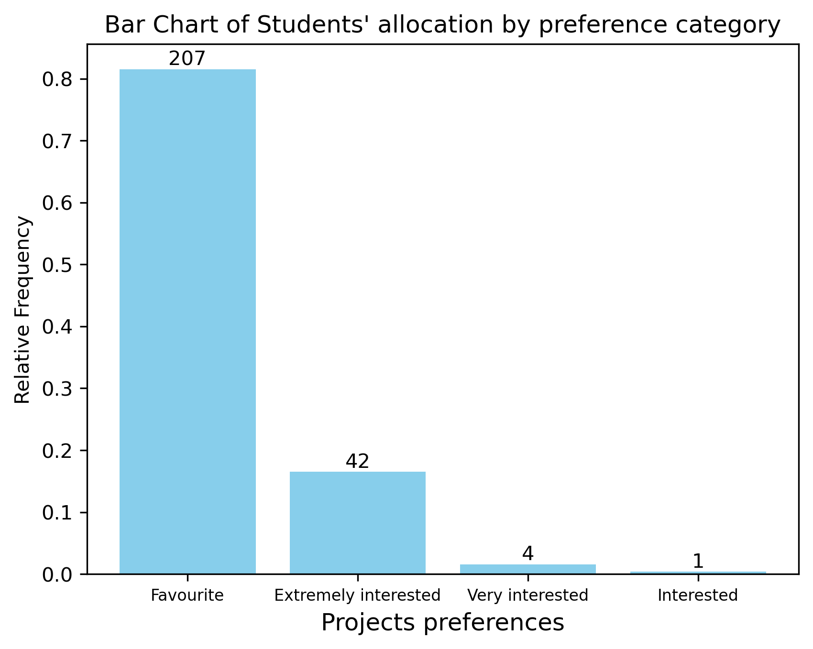
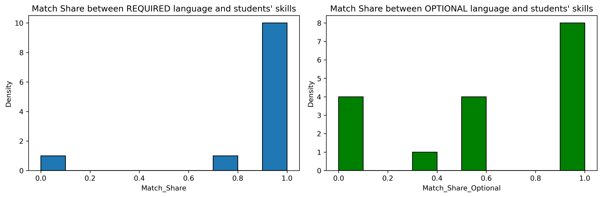

---
# Course title, summary, and position.
linktitle: Allocation algorithm grouping students (Python code)
title: Allocation algorithm
toc: false
summary: An allocation algorithm to assign students to groups based on their preferences
weight: 1

# Page metadata.
# title: The Template
# date: "2018-09-09T00:00:00Z"
# lastmod: "2018-09-09T00:00:00Z"
# draft: false  # Is this a draft? true/false
# toc: false  # Show table of contents? true/false
# type: docs  # Do not modify.

# Add menu entry to sidebar.
# - name: Declare this menu item as a parent with ID `name`.
# - weight: Position of link in menu.
# menu:
#  example:
#    name: The template TEST
#    weight: 1

links: 
# - name: Slides
#  url: https://www.dropbox.com/s/yff0zuihe49szfp/Cata_Presentation.pdf?dl=0
url_pdf: './Thesis_template_RV.pdf'
# url_project: ''
# url_slides: '#'
# url_source: '#'
# url_video: '#'
# - icon: far fa-file-pdf
#  icon_pack: fa
#  url: img/Family_Migration_Africa_and_Europe_RV_JMP_last_version.pdf
# Featured image
# To use, add an image named `featured.jpg/png` to your page's folder. 
image:
  caption: 'Image credit: [**Unsplash**](https://unsplash.com/photos/s9CC2SKySJM)'
  focal_point: ""
  preview_only: false


---


The algorithm with details and the example with the data used can be found: [here](https://github.com/RemiVine/Allocation_algorithm_ARP_GGI/blob/Allocation_algorithm/The_Algorithm.ipynb)


# What for?

Every year, the Graduate Institute of Geneva lauches its Applied Research Projects (ARP). It targets interdisciplinary master students and is an long term group project together with an institutional partner (International Organizations, Non-Governmental Organizations, companies, start-ups, etc.). There are a given number of pre-selected projects for a given number of students. [Details on ARP are to be found here.](https://www.graduateinstitute.ch/communications/news/invaluable-life-learning-applied-research-projects)

# Constraints 

A minimum number of students is imposed (and a maximum too). All pre-selected projects must have students allocated. 

Before the allocation, students are asked to rank their preferences. They attribute their first-best preferences to a handful of projects, their second-best preferences to another set of projects, their third-best prefrences to another; lastly, the remaining projects are not part of the projects students considered interesting for them to work on. 

Ideally, all students are assigned their top preferences but, empirically, the allocation is rarely fully composed of first-best preferences. 


# Hungarian Algorithm (Kuhn, 1955)

The present algorithm attemps to allocate students as well as possible, minimizing dissatisfaction. The most common and simple procedure used is the Hungarian algorithm and the current algothim is based on it. This is a linear optimization procedure where a cost matrice is minimized (or maximized). In practice, the procedure is relatively simple and consists in erasing step by step columns and rows. In the end, the selection starts with the first row(s) attributed with only one zero in all the columns.

# In a nutshell

This algorithm, entirely shown below with details, assumes that allocating students a non preferred choice is unreasonably "expensive" so that the minimization of the cost matrix dramatically suffers from allocating a student to a non-chosen project. Indeed, weights 0 are given to top choices, 3 to second best, 10 to third best, 20 to fourth best, and 50 to fifth best, and __1000__ to non-chosen projects (!). Therefore, if the algorithm allocates a student to a non-chosen project, it is mechanically because no other students (or k students supposed to be assigned to this group) have selected this project. This implies that there might be a discretionary decision not to keep this project if not enough students selected this project among the selected preferences. 

Overall, this algorithm is very simple, transparent in its method and extremely fast to be implemented (the full code for one allocation, along with data cleaning and some summary statistics takes less than 3 seconds - on my laptop). Suffices to have an excel file ready with students' preference like the one of year 2022. If constructing a different data set, one simply needs to be careful in dropping the appropriate variables. Fundamentally, students' index and students' ranking for each project are the only necessary variables. The data inspection section might be edited depending on the excel data set loaded (and it is easy to drop proprietary excel towards .csv or any other data set formats). 

# Important drawback 

This is a specific algorithm well-suited for such allocation. However, the price to pay to an easy and efficient allocation is the lack of refinement such as the inclusion of heterogeneous characteristics on top of students' preferences. Here, there is no account for extra characteristics such as language match between the students' skills and the partners' needs. There is also no _ad hoc_ matching where some partners would have requested 5 students or, on the contrary, 2 students. Here all partners are treated equally and so are students' preferences. In some respect, this overly simple allocation has the advantage of fairness towards partners and students. 


# Raw code available below: 


```python
#############################
#############################
#############################
# The whole code in one chunk
#############################
# Import necessary packages
from pulp import *
import numpy as np
import pandas as pd
import os
import matplotlib.pyplot as plt
#############################
# Paths 
save_path = "C:/Users/revine/OneDrive - EHL/Documents/IHEID/IHEID_ARP/2024/Allocation/"
data_load_path = "C:/Users/revine/OneDrive - EHL/Documents/IHEID/IHEID_ARP/2024/Allocation"
# Load data
filename = "ARP_results_coded_names.xlsx"
student_pref_data = pd.read_excel(os.path.join(data_load_path, filename), sheet_name= "Form responses 2")
print(student_pref_data.shape) #dimension of the dataframe
# drop unused variables
#student_pref_data = student_pref_data.drop(student_pref_data.columns[[1,2,3,4,5,6,7]], axis= 1)
student_pref_data = student_pref_data.drop(student_pref_data.columns[[0,2,3,74]], axis= 1)
#############################
# Define the costs of the allocation
mapping = {
    "Not interested": 10000,   # 10000
    "Somewhat interested": 50, # 50
    "Interested": 20,          # 20
    "Very interested": 10,     # 10
    "Extremely interested": 3, # 3
    "Favourite": 0             # 0
}
# Define the range of columns (from 1 to 70)
start_column = 1  # Start column position
end_column = 71   # End column position (inclusive)
# Iterate through the selected columns by position and apply replacement
for column_position in range(start_column, end_column + 1):
    column_name = student_pref_data.columns[column_position - 1]  # Convert position to column name
    student_pref_data[column_name] = student_pref_data[column_name].replace(mapping)
# Rename a variable
student_pref_data = student_pref_data.rename(columns={'Email address': 'Etudiant'})
# Construct the cost matrix from the table
# Put the variable 'Etudiant' as index
student_pref_data = student_pref_data.set_index('Etudiant')
# Converting into numeric matrix
cost_matrix = student_pref_data.values
# Define a new array with values labeled as 1, 2, 3, ...
number_students = np.arange(1, num_rows + 1)
# Get the number of rows in the matrix
num_columns = cost_matrix.shape[1]
# Define a new array with values labeled as 1, 2, 3, ...
number_projects = np.arange(1, num_columns + 1)
# Transform numpy.ndarray into lists
number_students = number_students.tolist()
number_projects = number_projects.tolist()
# Minimum number of students per project
k = len(number_students) // len(number_projects)
#############################
## Expand the cost matrix to make it square, simply duplicate the same initial matrix by factor k and add some columns if necessary
# Define the extra array one would need to build if the number of students is not a perfect factor of the number of projects
extra_column_array = np.full(len(number_students), 1000000)
extra_column_array = np.expand_dims(extra_column_array, axis=1) # necessary for further stacking (when non-empty reminder of division above)
# Now, the idea is to expand the matrix by the number of people per task (source: https://stats.stackexchange.com/questions/232462/is-there-an-algorithm-for-solving-a-many-to-one-assignment-problem)
# Stack columns k times
stacked_matrix = np.tile(cost_matrix, (1, k))
# Add extra columns if needed
stacked_matrix_extra = np.tile(extra_column_array, (1, extra_column))
# Put cost matrix duplicated and extra columns together
if extra_column == 0:
    cost_large = stacked_matrix
else: 
    cost_large = np.hstack((stacked_matrix, stacked_matrix_extra))
#############################
# Initialize the Linear Assignement problem
prob = LpProblem(name = "Assignment_Problem", sense = LpMinimize) 
# Define the decision variable
# The cost data is made into a dictionary
costs= makeDict([number_students, number_projects], cost_large, 0) # headers are workers & jobs, array is cost, and cost is by default 0
# Creates a list of tuples containing all the possible assignments
assign = [(s, p) for s in number_students for p in number_projects] # 4*4 number of tuples [(1,1), (1,2), ...)]
# A dictionary called 'Vars' is created to contain the referenced variables
vars = LpVariable.dicts(name = "Assign", indices = (number_students, number_projects), lowBound = 0, upBound = None, cat = LpBinary)
# Define the objective function
# The objective function is added to 'prob' first
prob += ( # starts the definition of a new term in the objective function.
    lpSum([vars[s][p] * costs[s][p] for (s, p) in assign]),
    "Sum_of_Assignment_Costs",
)
# Define the constraints
# There are row constraints. Each project can be assigned to only at most (k+1) students.
for p in number_projects:
    prob+= lpSum(vars[s][p] for s in number_students) <= k+1
    prob+= lpSum(vars[s][p] for s in number_students) >= k
# There are column constraints. Each student can be assigned to only one project.
for s in number_students:
    prob+= lpSum(vars[s][p] for p in number_projects) == 1
# Solve the model
# The problem is solved using PuLP's choice of Solver
prob.solve()
#############################
#############################
#############################
```

**Some extra information to assess the quality of the allocation**

# Visualize the share of students per group size

Visualize the share of groups with different number of students. The bar chart shows that there are only groups with three or four students, which is what was initially scheduled. 

<center></center>

# Visualize the number (and share) of students allocated depending on their preferences

Visualize the frequency of students obtaining their first, second and third choices. Beyond 80% of the students obtained their top choice, less than 1.4% of all students obtained a project in their third best set of projects. No student obtained a project that was not part of any preferred project. 

<center></center>

# Check the language skills

Importantly, students were asked about their language skills in order to ensure that the matching was also according to the language matching. Some partners informed on language requirements and/or on language preferred in the group (because of interviews to be conducted, literature only available in the local language, etc.). Unfortunately, this method cannot take such heterogeneity into account. That is the price of having a very simply and fully transparant analysis. 

However, one can argue that the self-selection of students will lead the allocation based on preference to allow for a sound language allocation on top of the students' preferences. It is expected that students must have internalized the language constraints into their preferences sorting. In fact, this is probably better to allocate using a simply algorithm and entrusting students so that language allocation is also appropriate. If not, it is not unrealistic to have the students bear the responsability of their own choices - as they were duly informed about the importance of the language allocation beforehand. 

<center></center>


# Raw code for the extra aspects


```python
#############################
#############################
#############################
### Some diagnotics
## Print all students-projects dyads & build a dataframe
# Create an empty list to store the output strings
output_list = []
# Create an empty DataFrame
df_allocation = pd.DataFrame(columns=["Student", "Group"])
# Print values equal to the target value
for v in prob.variables():
    if v.varValue == 1:
        # Extract student and group numbers from the variable name
        _, student, group = v.name.split("_")
        # Construct the output string
        output = "Student {} gets group {}".format(student, group)
        # Add the output string to the list
        output_list.append(output)
        # For dataframe
        # Extract student and group information
        student_info = int(student)
        group_info = int(group)
        # Add student and group information to the DataFrame (the row below is deprecated)
        # df_allocation = df_allocation.append({"Student": student_info, "Group": group_info}, ignore_index=True)
        # Create a new DataFrame for the new row
        new_row = pd.DataFrame({"Student": [student_info], "Group": [group_info]})   
        # Concatenate the new row with the original DataFrame
        df_allocation = pd.concat([df_allocation, new_row], ignore_index=True)
#############################
## Produce some summary statistics regarding the allocation
# Sort the allocation dataframe by Students' number
df_allocation_sorted = df_allocation.sort_values('Student')
# Extract the index and make it a new variable
student_pref_data = student_pref_data.rename_axis('NewIndex')
student_pref_data['Etudiant'] = student_pref_data.index
student_pref_data['Student'] = student_pref_data.reset_index().index + 1
# List all variables (columns) in the DataFrame
variables = student_pref_data.columns.tolist()
# Make sure the keys are of the same type, and integers.
df_allocation_sorted['Student'] = df_allocation_sorted['Student'].astype(int)
#############################
### Merge the initial dataframe and the allocation
merged_data = df_allocation_sorted.merge(student_pref_data, left_on='Student', right_on='Student')
merged_data_subset = merged_data[['Group', 'Etudiant']]
# Group by 'Group' and combine the values in 'Language competencies for the ARP projects'
merged_data_subset_grouped = merged_data_subset.groupby('Group', as_index=False).agg({
    'Etudiant': ', '.join ,
})
# Split the column into multiple columns (as many as needed)
merged_data_subset_grouped = merged_data_subset_grouped.join(merged_data_subset_grouped['Etudiant'].str.split(', ', expand=True))
merged_data_subset_grouped = merged_data_subset_grouped.drop(columns=['Etudiant'])
pd.set_option('display.max_rows', None)
pd.set_option('display.max_columns', None)
# Export in excel
name_of_file = 'Student_list_per_project.xlsx'
merged_data_subset_grouped.to_excel(save_path + name_of_file, index=False)  # Set index to False if you don't want to save the index
# Change names of columns to correspond to group number
# Rename columns 2 to the last projects' number
for col_idx in range(2, len(number_projects)+2):
    new_label = str(col_idx - 1)
    old_name = merged_data.columns[col_idx]
    merged_data = merged_data.rename(columns={old_name: new_label})
#############################
# Verify frequency for each group
frequency_number_student_group = merged_data['Group'].value_counts().sort_index()
# Transform the Series into a DataFrame
df_freq = frequency_number_student_group.to_frame()
df_freq = df_freq.rename(columns={'Group': 'Frequency'})
df_freq['Group'] = df_freq.index
# Grouping and counting frequencies
group_size = df_freq['Frequency'].value_counts()
# Converting the Series to a DataFrame
df_group_size = group_size.reset_index()
df_group_size.columns = ['Frequency', 'Count']
# Creating a new variable by multiplying the index and Frequency
df_group_size['Total Number Students'] = df_group_size['Frequency'] * df_group_size['Count']
# Calculating relative frequencies
total_students = df_group_size['Total Number Students'].sum()
print("Total number of students:", total_students)
df_group_size['Relative Frequency'] = df_group_size['Total Number Students'] / total_students
print(df_group_size)
# Creating the bar plot
plt.figure(figsize=(8, 6))
bars = plt.bar(df_group_size['Frequency'], df_group_size['Relative Frequency'], color='skyblue')
# Adding text labels on top of each bar for total number of students
for i, v in enumerate(df_group_size['Total Number Students']):
    plt.text(df_group_size['Frequency'][i], df_group_size['Relative Frequency'][i] + 0.01, str(v), ha='center')
plt.xlabel('Frequency')
plt.ylabel('Relative Frequency')
plt.title('Relative Frequencies with Total Number of Students')
plt.xticks(df_group_size['Frequency'])
plt.show()
#############################
# Define a mapping from values to labels
label_mapping = {
    0: 'Favourite',
    3: 'Extremely interested',
    10: 'Very interested',
    20: 'Interested',
    50: 'Somewhat interested',
    10000: 'Not interested'
}
# Map the 'Share_group' column to labels
merged_data['Share_group'] = merged_data['Share_group'].map(label_mapping)
# Count the frequency of each value
frequency_share = merged_data['Share_group'].value_counts()
frequency_share
# Calculate relative frequencies
relative_freq = frequency_share / len(merged_data)
# Create the bar chart
plt.bar(relative_freq.index, relative_freq, color='skyblue')
# Set the labels and title
plt.xlabel('Projects preferences', size=12)
# Adjust the font size of the x-axis labels
plt.xticks(fontsize=8)
plt.ylabel('Relative Frequency')
plt.title("Bar Chart of Students' allocation by preference category")
# Add frequencies to the bars
for i, freq in enumerate(frequency_share):
    plt.text(i, relative_freq[i], f'{freq}', ha='center', va='bottom')
plt.show()
#############################
## Check for language
# Create subset with students' email, langauge requests, and group allocation
filename = "ARP_results_coded_names.xlsx"
student_language= pd.read_excel(os.path.join(data_load_path, filename), sheet_name= "Form responses 2") 
# Specify the column numbers you want to keep (e.g., columns 0 and 2)
columns_to_keep = [1, 74]
# Use iloc to select columns by column numbers
student_language = student_language.iloc[:, columns_to_keep]
stud_grouped_lang = student_language.merge(merged_data, left_on='Email address', right_on='Etudiant')
stud_grouped_lang = stud_grouped_lang.iloc[:, [0,1,3]]
stud_grouped_lang = stud_grouped_lang.sort_values('Group')
# Convert 'Language competencies for the ARP projects' to strings
stud_grouped_lang['Language competencies for the ARP projects'] = stud_grouped_lang['Language competencies for the ARP projects'].astype(str)
# Group by 'Group' and combine the values in 'Language competencies for the ARP projects'
compressed_stud = stud_grouped_lang.groupby('Group', as_index=False).agg({
    'Email address': ', '.join ,
    'Language competencies for the ARP projects': ', '.join
})
# Split the column into multiple columns (as many as needed)
compressed_stud = compressed_stud.join(compressed_stud['Language competencies for the ARP projects'].str.split(', ', expand=True))
# Drop the original column because not needed
compressed_stud = compressed_stud.drop(columns=['Language competencies for the ARP projects'])
merged_data_language = detailed_skills.merge(compressed_stud,left_on ='Project', right_on='Group')
# Replace various representations of missing values with np.nan
merged_data_language = merged_data_language.replace({None: np.nan})
merged_data_language = merged_data_language.replace(['nan'], np.nan, regex=True)
#############################
## Assign the language allocation
# Define a function to calculate the share of fully matched criteria for each row
def calculate_match_share(row):
    l_columns = row[['Language 1', 'Language 2', 'Language 3', 'Language 4', 'Language 5']]
    #availability_columns = row[['1', '2', '3', '4', '5', '6', '7', '8', '9', '10']]  
    availability_columns = row[[0,1,2,3,4,5,6,7,8,9]]  
    # Create a dictionary to store required criteria in L columns and their counts
    l_criteria = {}
    for l in l_columns:
        if not pd.isna(l) and l != 'NONE':
            if l not in l_criteria:
                l_criteria[l] = 1
            else:
                l_criteria[l] += 1
    if not l_criteria:
        return np.nan
    # Initialize a match count
    match_count = 0
    for l, count in l_criteria.items():
        # Count how many times each string in L columns appears in M columns
        count_in_available = availability_columns.tolist().count(l)
        # Update the match count based on the counts of strings in L and M columns
        match_count += min(count, count_in_available)
    # Calculate the match share
    match_share = match_count / sum(l_criteria.values())
    return match_share
    ##
    ##    
def calculate_match_share_opt(row):
    l_columns_options = row[['Optional language 1', 'Optional language 2', 'Optional language 3', 'Optional language 4', 'Optional language 5']]
    #availability_columns = row[['1', '2', '3', '4', '5', '6', '7', '8', '9', '10']]  
    availability_columns = row[[0,1,2,3,4,5,6,7,8,9]]  
    # Do the same for the optional criteria
    l_criteria_opt = {}
    for l in l_columns_options:
        if not pd.isna(l) and l != 'NONE':
            if l not in l_criteria_opt:
                l_criteria_opt[l] = 1
            else:
                l_criteria_opt[l] += 1
    if not l_criteria_opt:
        return np.nan  
    # Initialize a match count
    match_count_opt = 0
    for l, count in l_criteria_opt.items():
        # Count how many times each string in L columns appears in M columns
        count_in_available = availability_columns.tolist().count(l)
        # Update the match count based on the counts of strings in L and M columns
        match_count_opt += min(count, count_in_available)
    # Calculate the match share
    match_share_opt = match_count_opt / sum(l_criteria_opt.values())
    return match_share_opt   
##
# Calculate the share of fully matched criteria for each row
merged_data_language['Match_Share'] = merged_data_language.apply(calculate_match_share, axis=1)
merged_data_language['Match_Share_Optional'] = merged_data_language.apply(calculate_match_share_opt, axis=1)
# Summary statistics
merged_data_language[['Match_Share', 'Match_Share_Optional']].describe()
# Plot histograms for 'Age' and 'Income'
plt.figure(figsize=(12, 4))
#
plt.subplot(1, 2, 1)
plt.hist(merged_data_language['Match_Share'], 
         density=False, bins=10, edgecolor='black')
plt.xlabel('Match_Share')
plt.ylabel('Density')
plt.title("Match Share between REQUIRED language and students' skills")
#
plt.subplot(1, 2, 2)
plt.hist(merged_data_language['Match_Share_Optional'], 
         density=False, bins=10, edgecolor='black', color='green')
plt.xlabel('Match_Share_Optional')
plt.ylabel('Density')
plt.title("Match Share between OPTIONAL language and students' skills")
#
plt.tight_layout()
plt.show()
#############################
#############################
#############################
```


