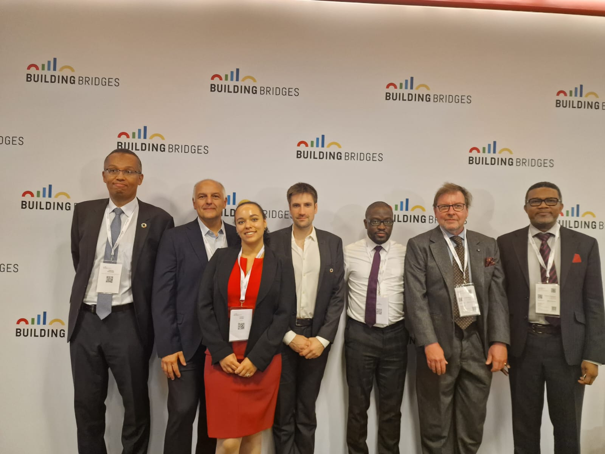

---
# Course title, summary, and position.
linktitle: Some ideas on remittances
title: Remittances - what for?
toc: false
summary: Remittances as a tool for meso-level investment
weight: 1

# Page metadata.
# title: The Template
# date: "2018-09-09T00:00:00Z"
# lastmod: "2018-09-09T00:00:00Z"
# draft: false  # Is this a draft? true/false
# toc: false  # Show table of contents? true/false
# type: docs  # Do not modify.

# Add menu entry to sidebar.
# - name: Declare this menu item as a parent with ID `name`.
# - weight: Position of link in menu.
# menu:
#  example:
#    name: The template TEST
#    weight: 1

links: 
# - name: Slides
#  url: https://www.dropbox.com/s/yff0zuihe49szfp/Cata_Presentation.pdf?dl=0
url_pdf: './Thesis_template_RV.pdf'
# url_project: ''
# url_slides: '#'
# url_source: '#'
# url_video: '#'
# - icon: far fa-file-pdf
#  icon_pack: fa
#  url: img/Family_Migration_Africa_and_Europe_RV_JMP_last_version.pdf
# Featured image
# To use, add an image named `featured.jpg/png` to your page's folder. 
image:
  caption: 'Image credit: [**Unsplash**](https://unsplash.com/photos/s9CC2SKySJM)'
  focal_point: ""
  preview_only: false

---

Remittances can be a tremendous tool for development and I work with Dr. Nestor Morgandi and Dr. Chirstian Kingombé (Managing partner of [4IP Group](http://4ipgroup.org/)) to promote remittances as a tool for development that lies between the macro approach performed by international organizations and the micro level development, where remittances are mostly used so far. Pursuing this, we worked with [Abrod](https://a-brod.com/) and participated to the 2022 Geneva Building Bridges conference ([conference](https://www.youtube.com/watch?v=wBXGulGi5WI)). 

<!--
TEST1

TEST2

-->

<!--
The video-insering code is taken here: 
https://stackoverflow.com/questions/69326962/insert-embeded-youtube-video-in-markdown-vs-code
-->

 <iframe width="560" 
         height="315" 
         src="https://www.youtube.com/embed/wBXGulGi5WI" 
         title="YouTube video player" 
         frameborder="0" 
         allow="accelerometer; autoplay; clipboard-write; encrypted-media; gyroscope; picture-in-picture" 
         allowfullscreen>
 </iframe>

<!--
TEST3 

-->

I also work in research on the topic, trying to highlight (i) the issue of the oligopolies of Remittances Service Providers, as prices can increase - relatively - after a disaster (see [here](https://remivine.com/publication/3-remittances-costs-catastrophes/)), (ii) the complexity of the use of remittances, at the intersection of emergency spending, spending to face poverty, spending to invest, and spending to conspiciously climb on the social ladder (see [here](https://remivine.com/publication/2-tajikistan-remittances/)). 

