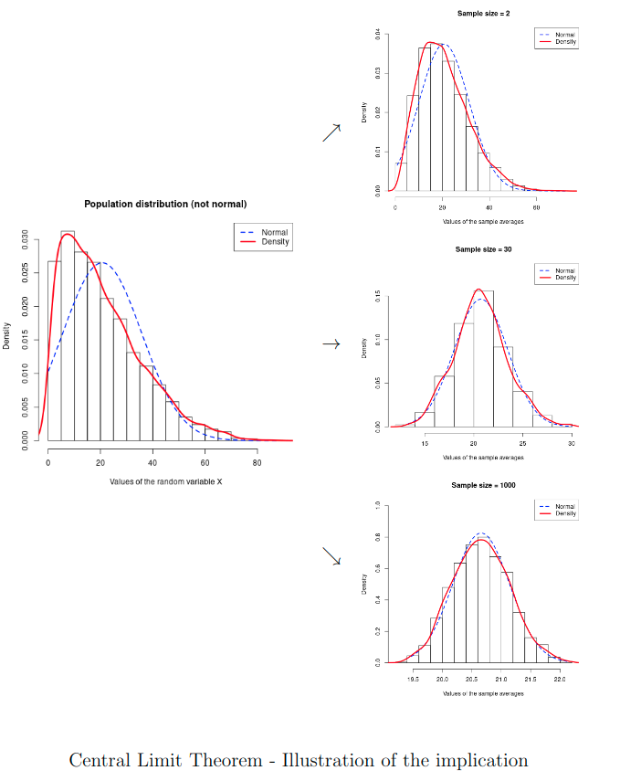

---
# Course title, summary, and position.
linktitle: Statistics
summary: Some materials about statistics for students in social sciences
weight: 5

# Page metadata.
title: Material
date: "2018-09-09T00:00:00Z"
lastmod: "2018-09-09T00:00:00Z"
draft: false  # Is this a draft? true/false
toc: true  # Show table of contents? true/false
type: docs  # Do not modify.

# Add menu entry to sidebar.
# - name: Declare this menu item as a parent with ID `name`.
# - weight: Position of link in menu.
menu:
  Material:
    name: Different types of material
    weight: 1
---

I make some materials (lectures, extra notes, exercices, exams) about statistics for students in social sciences available here. Most of the material is intuitive and aims to give intuitions behind concepts. I always value constructive feedback on this material, so feel free to reach out through my contact address. 

